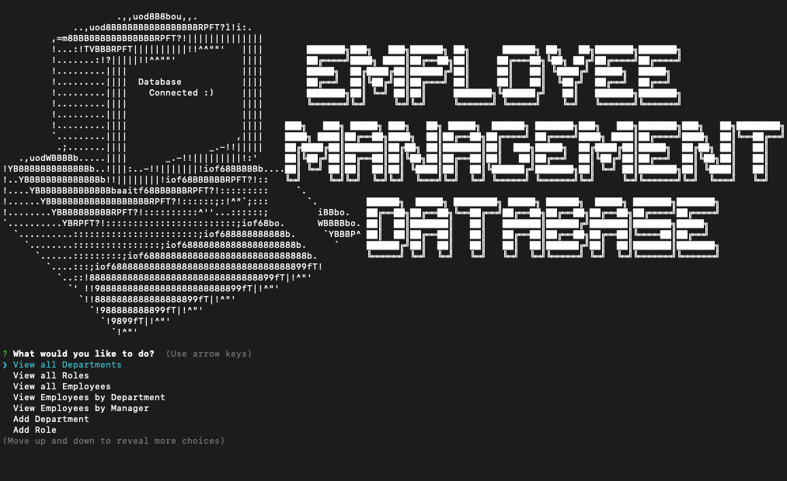

# Employee Management CMS
 
          

## Description
Manage your Employee Database with this handy CLI program written for Node.js.  

## Table of Contents

* [Description](#description)
* [Table of Contents](#table-of-contents)
* [Installation](#installation)
* [Usage](#usage)
* [Credits](#credits)
* [Questions](#questions)
* [License](#license)

## Installation

This program requires that the end user already has `Node.js` and `MySQL` set up and running on their system.  
 Copy the repository files by running `git clone git@github.com:Qcent/employee-db-CSM.git`  
 Before you first run the program you will have to set up the database by connecting to your MySQL server and typing `source db/db.sql`  
 If you would like to load some mock data to the database type `source db/seeds.sql` 

## Usage

Once finished with the initial setup mearly type `node index.js` or `npm start` to run the application.  
 You will be greated by the landing screen while the app connects to the MySQL server then presented with a list of option to choose from.    
 Follow the on screen prompts to View / Create / Edit or Delete: Departments, Roles and Employees from your company database. 

## Credits
Big thanks goes out to the Hard Coding Developers responsible for the npm packages `Inquirer` and `MySQL2`, for making this and many other projects possible. I'd also like to extend my warm and heartfelt appriciation to Eric the TA. Whose paient soul and mindful eye helped reveal my broken logic and set me back on the path to glory! 

## Questions

[GitHub: Qcent](https://github.com/Qcent)  
dquinn8@cogeco.ca

   
## License

MIT License

Copyright (c) 2021 Dave Quinn

Permission is hereby granted, free of charge, to any person obtaining a copy
of this software and associated documentation files (the "Software"), to deal
in the Software without restriction, including without limitation the rights
to use, copy, modify, merge, publish, distribute, sublicense, and/or sell
copies of the Software, and to permit persons to whom the Software is
furnished to do so, subject to the following conditions:

The above copyright notice and this permission notice shall be included in all
copies or substantial portions of the Software.

THE SOFTWARE IS PROVIDED "AS IS", WITHOUT WARRANTY OF ANY KIND, EXPRESS OR
IMPLIED, INCLUDING BUT NOT LIMITED TO THE WARRANTIES OF MERCHANTABILITY,
FITNESS FOR A PARTICULAR PURPOSE AND NONINFRINGEMENT. IN NO EVENT SHALL THE
AUTHORS OR COPYRIGHT HOLDERS BE LIABLE FOR ANY CLAIM, DAMAGES OR OTHER
LIABILITY, WHETHER IN AN ACTION OF CONTRACT, TORT OR OTHERWISE, ARISING FROM,
OUT OF OR IN CONNECTION WITH THE SOFTWARE OR THE USE OR OTHER DEALINGS IN THE
SOFTWARE.
                 

     
